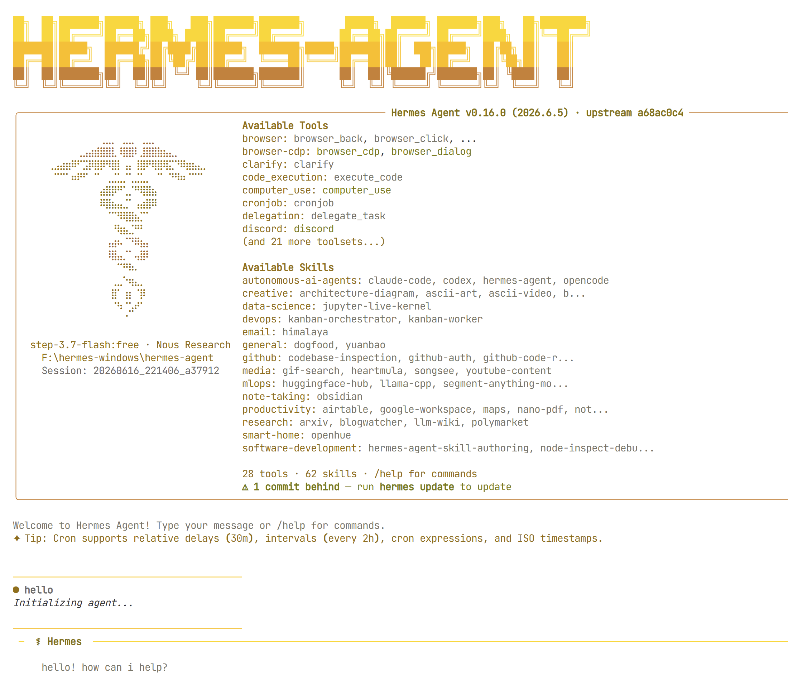
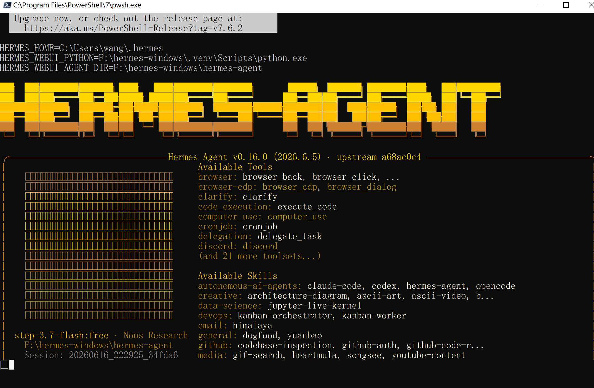
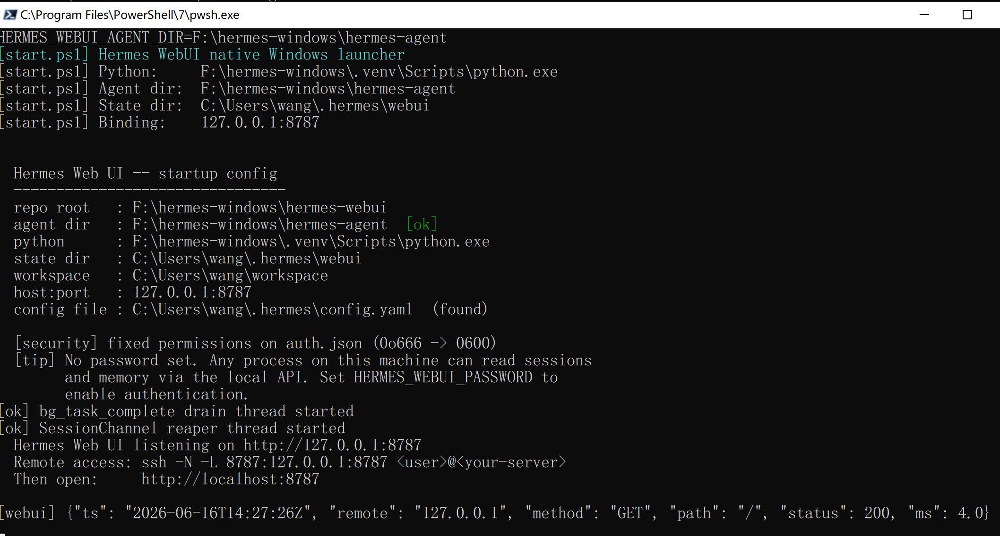
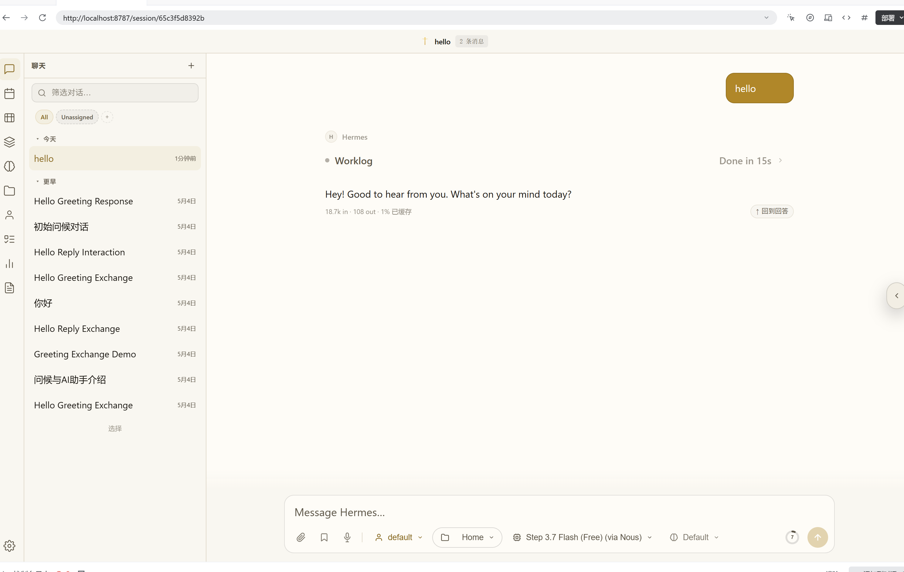

# Hermes Agent Windows Native Guide

[English](./README.md) | 简体中文

这是 **Hermes Agent + Hermes WebUI Windows 原生整合包** 的中文说明书首页。

本仓库不是官方 `hermes-agent` README 的中文翻译，也不是上游安装文档的简单搬运。它专门负责说明 Windows 原生整合布局怎么安装、怎么启动、怎么验证，以及这个整合包当前已经被哪些截图和流程证明可用。

## 文档内容

- Windows 原生整合布局说明
- 共享 `.venv` 的使用方式
- 一键启动流程
- 启动验证截图
- 安装与快速开始导航

## 文档导航

| 文档 | 用途 |
|---|---|
| [Installation](./zh-CN/installation.md) | 首次安装、环境准备、目录结构和启动前检查 |
| [Quick Start](./zh-CN/quick-start.md) | 已准备好文件后的最短启动路径和首次登录流程 |

## 免费模型

截至 **2026-06-17**，当前实测可用的免 key 免费模型只有这两个：

- `stepfun/step-3.7-flash:free`
- `nvidia/nemotron-3-ultra:free`

本说明书中的 Windows 原生启动流程，当前就是基于这两个免费模型的实测结果整理的。

## 快速开始

1. 准备一个 Windows 原生项目根目录，里面包含 `.venv`、`hermes-agent`、`hermes-webui`、`hermes-start`。
2. 让 `hermes-agent` 和 `hermes-webui` 共用同一个 `.venv`。
3. 通过 `hermes-start\hermes-start.ps1` 启动整合包。
4. 等待 Hermes Agent 和 Hermes WebUI 分别在两个 PowerShell 窗口中拉起。
5. 打开浏览器访问 WebUI，确认首页加载成功。
6. 详细步骤请继续看 [Installation](./zh-CN/installation.md) 和 [Quick Start](./zh-CN/quick-start.md)。

## Windows 原生目录布局

| 路径 | 作用 |
|---|---|
| `.venv` | 共享 Python 虚拟环境 |
| `hermes-agent` | Hermes Agent 上游源码与运行主体 |
| `hermes-webui` | Hermes WebUI 上游源码与浏览器界面 |
| `hermes-start` | Windows 原生启动脚本目录，负责 Agent、WebUI 和一键启动 |

这套目录结构，就是本整合包和上游 README 的核心区别。  
上游 README 介绍的是 Hermes Agent 项目本身；这里介绍的是 **Windows 原生整合层**。

## Windows 原生验证

下面这些截图都来自真实的 Windows 原生环境，不是摆拍，也不是示意图。它们组成了一条完整的证据链：

- Hermes Agent 可以从 PowerShell 正常启动
- Hermes Agent 启动后能持续运行
- Hermes WebUI 可以在 Windows 原生环境中正常打开
- Hermes WebUI 不只是能打开，还能成功完成一轮聊天

### 1. Hermes Agent 启动命令

这张图证明 Hermes Agent 的启动入口是在原生 PowerShell 中执行的，不依赖 WSL2，也不依赖 Docker。

### 2. Hermes Agent 运行成功

这张图证明 Hermes Agent 不是只执行了一次命令，而是真正启动完成并在 Windows 原生环境中持续运行。

### 3. Hermes WebUI 运行成功

这张图证明 Hermes WebUI 已经成功启动，浏览器访问层已经可用。

### 4. Hermes WebUI 聊天成功

这张图证明 WebUI 不只是能打开，而是真的能完成一次正常聊天交互。

## 能力概览

- Windows 原生启动路径，不要求 WSL2，不要求 Docker
- `hermes-agent` 与 `hermes-webui` 共用一个 `.venv`
- Agent 与 WebUI 分别在独立 PowerShell 窗口中运行，日志可直接观察
- 通过 `hermes-start\hermes-start.ps1` 实现一键启动
- 首页截图直接给出可审计的运行证据
- 独立文档仓库负责安装、启动、截图和后续操作说明

## 适用范围与限制

- 本 README 面向 Windows 原生整合包，不面向通用上游安装方式。
- 本说明书不替代官方 `NousResearch/hermes-agent` README。
- 当前说明书默认的整合布局包含 `.venv`、`hermes-agent`、`hermes-webui`、`hermes-start`。
- 本 README 只负责首页概览；详细安装和首次启动流程分别写在 `./zh-CN/installation.md` 与 `./zh-CN/quick-start.md`。
- 当前首页证据图主要来自 `./images/readme/` 与 `./images/screenshots/`。

## 为什么这个 README 有必要

Windows 原生整合包不能只有几张截图，也不能只给一堆脚本名。首页必须先把这些问题讲清楚：

- 这到底是什么
- 它和官方上游 README 的区别是什么
- 目录结构长什么样
- 用户应该从哪里开始
- 当前到底有没有真实可验证的运行结果

这份 README 现在就是干这个的。

## 仓库内容

- `README.md`：英文首页总览、截图证据、文档导航
- `README.zh-CN.md`：中文首页说明
- `EN/installation.md`：英文安装说明
- `EN/quick-start.md`：英文快速开始说明
- `zh-CN/installation.md`：中文安装说明
- `zh-CN/quick-start.md`：中文快速开始说明
- `images/readme/`：README 首页验证图
- `images/screenshots/`：额外的界面与功能截图

## 当前状态

- 首页结构已经从“单纯截图展示”升级为“可直接引导用户开始使用”的入口页
- Windows 原生启动验证图已经整理成完整证据链
- 中英文安装文档和快速开始文档已经挂到首页
- 后续更细的操作文档会继续补到 `EN/` 与 `zh-CN/` 目录

## 上游项目

这个 Windows 原生整合说明书基于以下上游项目：

- `hermes-agent`：[NousResearch/hermes-agent](https://github.com/NousResearch/hermes-agent)
- `hermes-webui`：[nesquena/hermes-webui](https://github.com/nesquena/hermes-webui)
