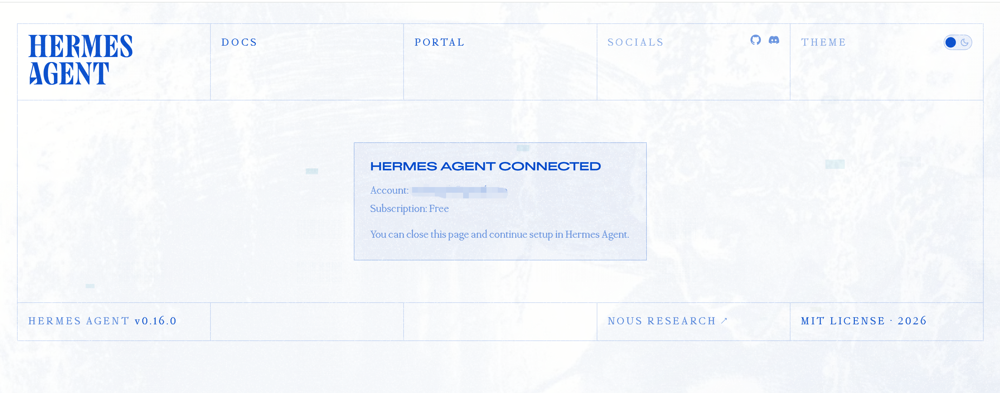
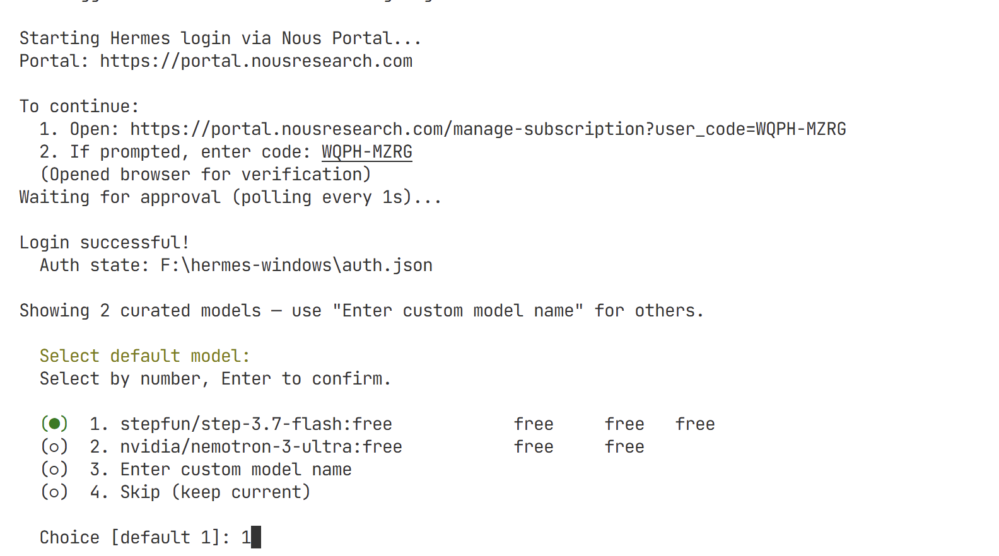
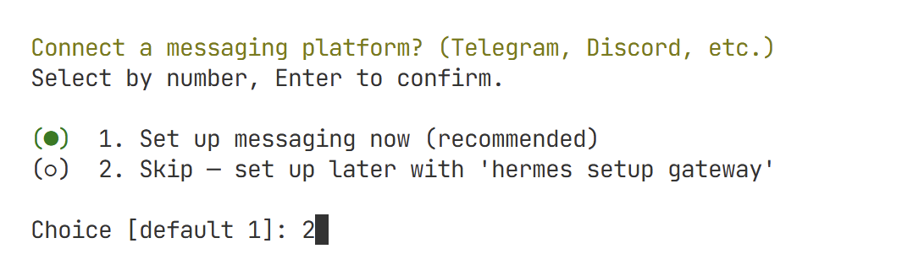
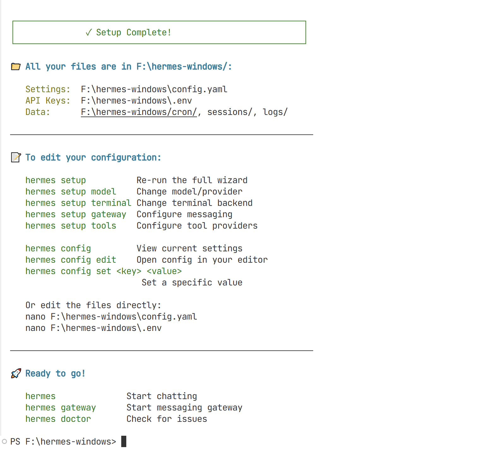

# Quick Start

## 免费模型

截至 **2026-06-17**，当前实测可用的免 key 免费模型是：

- `stepfun/step-3.7-flash:free`
- `nvidia/nemotron-3-ultra:free`

在本文档展示的 Windows 原生启动流程里，当前确认可用的免费模型只有这两个。

## 概览

本文档说明在文件、共享 `.venv` 和启动脚本都已经准备好的前提下，如何用最快的方式启动 Hermes Windows Native。

`images/quick-start/` 里的截图，记录的是 Hermes Agent 在 Windows 原生环境中的一次真实首次配置流程。

## 开始前

先确认下面这些东西已经准备好：

- 根目录已经创建
- `hermes-agent` 已经下载
- `hermes-webui` 已经下载
- 共享 `.venv` 已经存在
- `hermes-start` PowerShell 启动脚本已经存在

如果这些步骤还没完成，先看 [Installation](./installation.md)。

## 入口命令

通常先完成 Hermes Agent 的首次设置，再使用整合启动脚本。

Hermes Agent：

```powershell
F:\hermes-agent-windows\.venv\Scripts\hermes.exe
```

整合版一键启动：

```powershell
F:\hermes-agent-windows\hermes-start\hermes-start.ps1
```

如果你的实际根目录仍然是 `F:\hermes-windows`，把示例路径替换掉。

## 快速开始流程

### 第 1 步：打开 Nous Portal 套餐页面

当 Hermes 首次启动登录流程时，浏览器会打开 Nous Portal 的订阅页面。

选择一个套餐，然后继续后续连接流程。


### 第 2 步：确认 Hermes Agent 已连接

完成 portal 步骤后，浏览器会显示成功页面，表示 Hermes Agent 已经连接到你的账号。

这一步完成后，可以关闭浏览器页面。



### 第 3 步：完成登录并选择默认模型

回到 PowerShell 后，Hermes 会确认登录成功，并提示你选择默认模型。

下面这张图展示的是成功登录并完成模型选择的流程。



### 第 4 步：先跳过 Messaging 配置

Hermes 可能会询问你是否要连接 Telegram、Discord 之类的消息平台。

如果你的目标是最快把本地 Windows 原生环境跑起来，先跳过这一步，后面有需要再配。



### 第 5 步：完成初始化

当初始化完成后，Hermes 会显示本地配置文件位置，并打印后续可直接使用的命令。

到这里，Hermes Agent 的基础初始化就完成了。



## 启动整合版 Windows 布局

Hermes Agent 初始化完成后，用下面这条命令启动整合布局：

```powershell
F:\hermes-agent-windows\hermes-start\hermes-start.ps1
```

这个脚本会依次启动：

1. Hermes Agent
2. Hermes WebUI

启动顺序由 PowerShell 启动器自动控制。

## 预期结果

整合启动成功后：

- 一个 PowerShell 窗口运行 Hermes Agent
- 一个 PowerShell 窗口运行 Hermes WebUI
- 浏览器可以打开 WebUI
- 正常聊天可以成功完成一轮

默认 WebUI 地址：

```text
http://127.0.0.1:8787/
```

## 说明

- 本快速开始默认安装已经完成
- 这些截图都来自真实的 Windows 原生环境，不是示意图
- Messaging 平台配置可以等本地 Windows 原生环境先跑起来后再补
- 如果启动脚本里还是硬编码 `F:\hermes-windows`，而你实际用的是 `F:\hermes-agent-windows`，那就先把路径改掉
